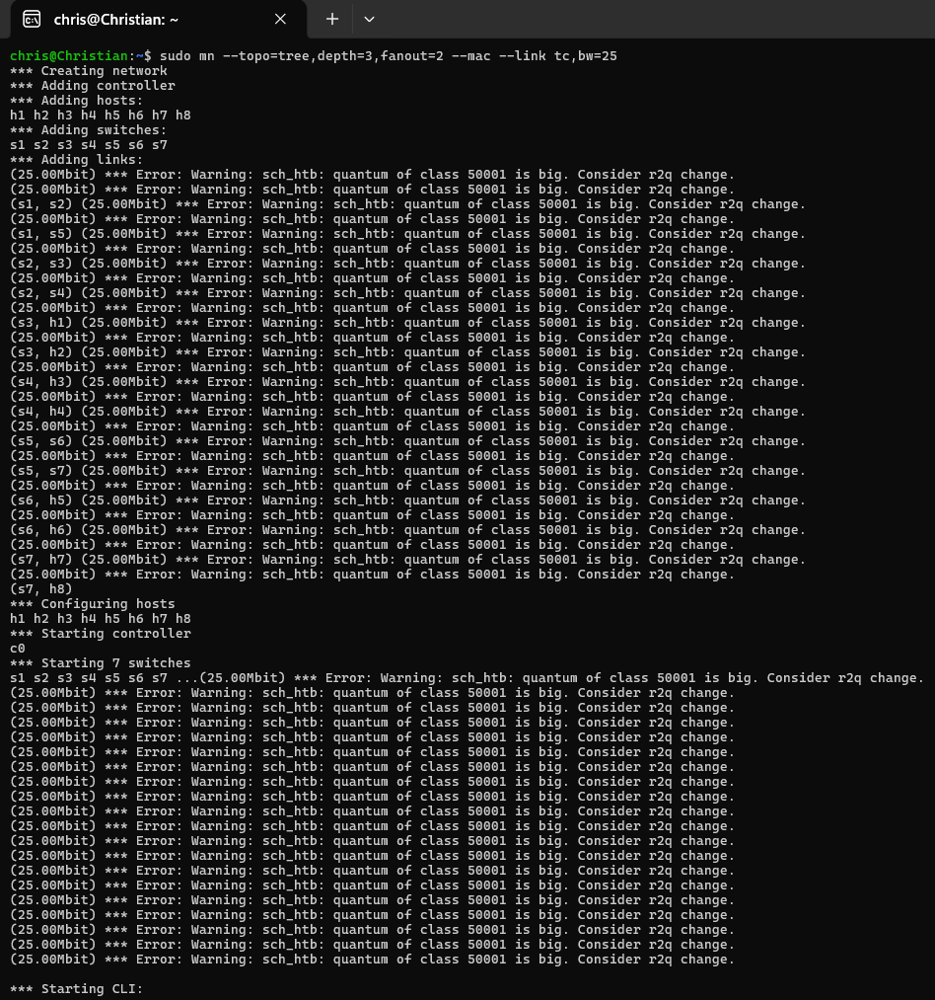
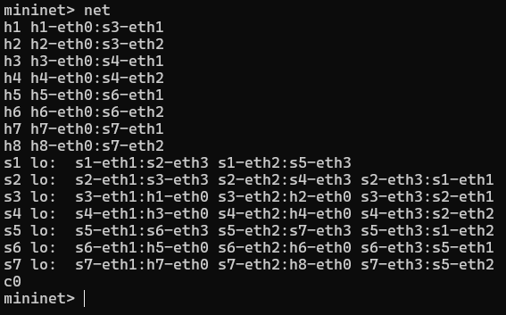
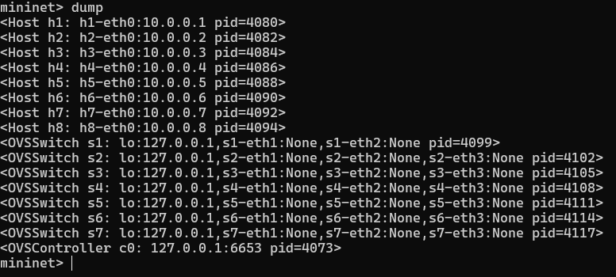
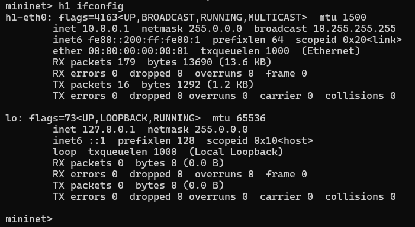
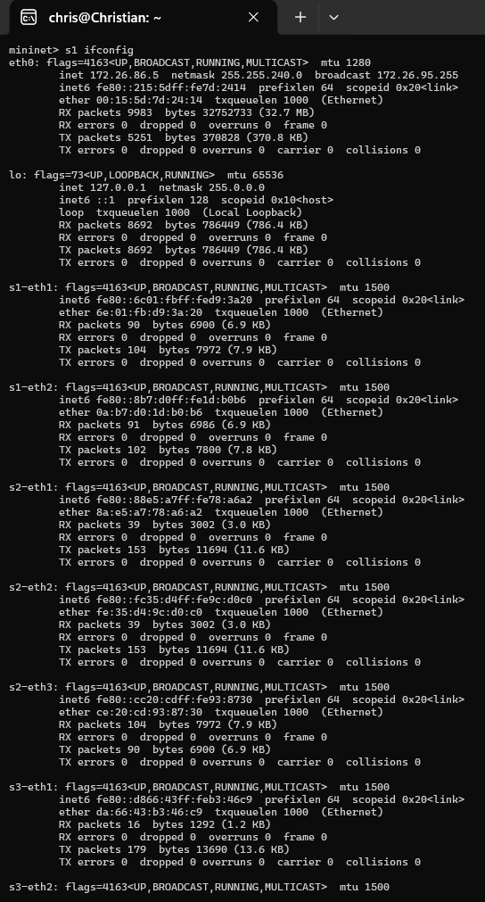
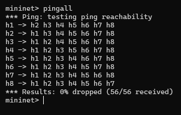
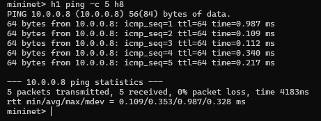
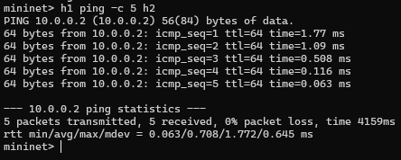
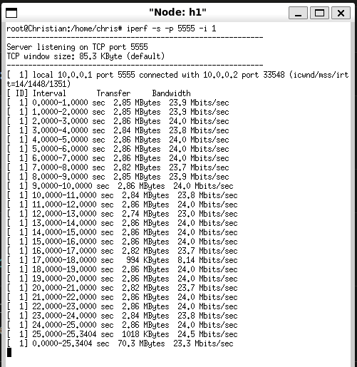
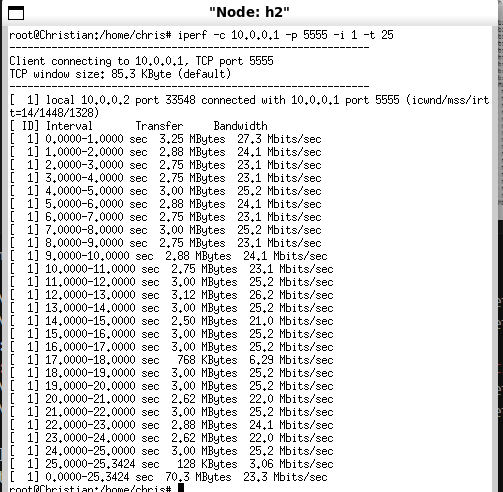

# Relatório de Experimento: Simulação de Topologia em Árvore com Mininet

Este documento apresenta os resultados obtidos durante a simulação de uma rede de computadores utilizando a ferramenta Mininet. O objetivo deste experimento foi configurar uma topologia em árvore (Tree) e validar o desempenho e a conectividade dos nós através de ferramentas de inspeção e medição.

## 1. Configuração da Topologia
A topologia foi estruturada seguindo os requisitos de profundidade e ramificação:
*   **Tipo:** Árvore (Tree).
*   **Profundidade (depth):** 3 níveis de switches.
*   **Ramificação (fanout):** 2.
*   **Componentes:** 8 hosts (h1 a h8) e 7 switches (s1 a s7).

---

## 2. Roteiro de Execução

### Passo 1: Inicialização da Rede
Para criar a topologia, foi utilizado o comando padrão do Mininet, configurando limites de banda e endereçamento MAC simplificado para facilitar a análise:

```bash
sudo mn --topo=tree,depth=3,fanout=2 --mac --link tc,bw=25
```

**Parâmetros utilizados:**
*   `--topo=tree,depth=3,fanout=2`: Define a hierarquia da árvore.
*   `--mac`: Atribui endereços MAC sequenciais.
*   `--link tc,bw=25`: Define a largura de banda de todos os enlaces em 25 Mbps.
*   **Controlador:** Foi utilizado o controlador padrão do Mininet.



---

### Passo 2: Inspeção da Topologia
Após a inicialização, foram executados comandos para verificar a integridade da rede e o endereçamento dos nós dentro do CLI do Mininet (`mininet>`).

#### Listagem de Nós
O comando `nodes` permite visualizar todos os elementos ativos na simulação:
```bash
nodes
```


#### Mapeamento de Enlaces e Portas
Através do comando `net`, é possível identificar as conexões físicas entre hosts e switches:
```bash
net
```


#### Informações Detalhadas (Dump)
O comando `dump` apresenta informações técnicas como endereços IP e PIDs dos processos:
```bash
dump
```


#### Configuração de Interfaces (ifconfig)
Para validar os endereços IP e MAC em nível de sistema, utilizou-se o `ifconfig` nos nós h1 e s1:
```bash
h1 ifconfig
s1 ifconfig
```



---

### Passo 3: Testes de Conectividade
Nesta etapa, validou-se a capacidade de comunicação entre os diferentes níveis da árvore.

#### Teste Geral (pingall)
Verificação de conectividade entre todos os pares de hosts da rede:
```bash
pingall
```


#### Teste de Longa Distância (h1 para h8)
Ping realizado entre os nós mais distantes da topologia (passando por 6 saltos):
```bash
h1 ping -c 5 h8
```


#### Teste Local (h1 para h2)
Ping entre hosts conectados ao mesmo switch de borda:
```bash
h1 ping -c 5 h2
```


---

### Passo 4: Análise de Desempenho com Iperf
Para finalizar o experimento, foi realizado um teste de vazão (throughput) entre o host 1 e o host 2 utilizando o protocolo TCP.

A configuração consistiu em definir o **h1 como servidor** e o **h2 como cliente**, com um relatório de banda a cada segundo durante 25 segundos.

**Comandos executados nos terminais virtuais (xterm):**
```bash
# Terminal h1 (Servidor)
iperf -s -p 5555 -i 1

# Terminal h2 (Cliente)
iperf -c 10.0.0.1 -p 5555 -i 1 -t 25
```

#### Resultados de Vazão:
Como a largura de banda foi limitada em 25 Mbps no passo inicial, os resultados confirmaram que a rede operou conforme o esperado, mantendo a vazão próxima ao limite configurado.

**Servidor h1:**


**Cliente h2:**

