# Questão 1: Simulação de Topologia Linear com Mininet

## Relatório de Experimento: Topologia Linear com 8 Switches

Este documento apresenta os resultados obtidos durante a simulação de uma rede de computadores utilizando a ferramenta Mininet.

---

## 1. Configuração da Topologia

A topologia foi estruturada seguindo os requisitos propostos:

*   **Tipo:** Linear.
*   **Componentes:** 8 switches (s1 a s8) e 8 hosts (h1 a h8).
*   **Endereçamento:** MAC padronizado via `--mac`.
*   **Largura de Banda:** 20 Mbps (inicial), posteriormente 30 Mbps e 40 Mbps.
*   **Controlador:** Padrão do Mininet.

---

## 2. Roteiro de Execução

### Passo 1: Inicialização da Rede (Item a)

Para criar a topologia linear com largura de banda inicial de 20 Mbps, foi utilizado o comando padrão do Mininet, configurando endereçamento MAC sequencial e limites de banda:

```bash
sudo mn --topo=linear,8 --mac --link tc,bw=20
```

**Parâmetros utilizados:**

*   `--topo=linear,8`: Cria uma topologia linear com 8 switches, cada um conectado a 1 host de acesso.
*   `--mac`: Atribui endereços MAC sequenciais simplificados.
*   `--link tc,bw=20`: Define a largura de banda de todos os enlaces em 20 Mbps.
*   **Controlador:** Padrão do Mininet (não especificado, utiliza o padrão do sistema).


---

### Passo 2: Inspeção das Interfaces, MACs, IPs e Portas (Item b)

Após a inicialização, foram executados comandos dentro do CLI do Mininet (`mininet>`) para verificar a integridade da rede, o endereçamento dos nós e as portas de conexão.

#### 2.1 Listagem de Nós

O comando `nodes` permite visualizar todos os elementos ativos na simulação:

```bash
nodes
```

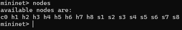

#### 2.2 Mapeamento de Enlaces e Portas

Através do comando `net`, identificam-se as conexões físicas entre os componentes:

```bash
net
```

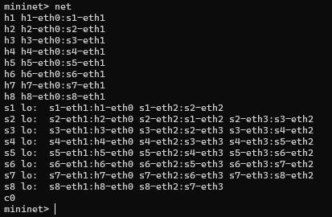

#### 2.3 Informações Detalhadas (Dump)

O comando `dump` mostra detalhes técnicos como endereços IP de cada host e o PID dos respectivos processos:

```bash
dump
```

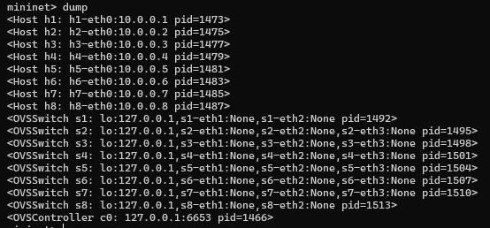

#### 2.4 Configuração de Interfaces (ifconfig)

Para inspecionar e documentar os endereços IP, MAC e interfaces internas, aplicou-se `ifconfig` nos componentes:

```bash
h1 ifconfig
h2 ifconfig
```

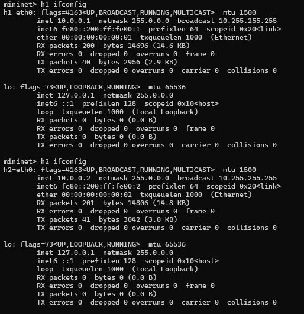

Inspeção detalhada com `ifconfig -a`:

```bash
h1 ifconfig -a
```

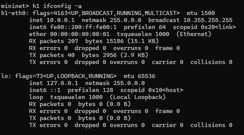

```bash
s1 ifconfig -a
```

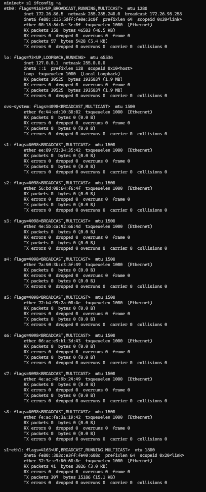

.png)

.png)

---

### Passo 3: Desenho Ilustrativo da Topologia (Item c)

Com base nas informações obtidas através do `dump` e `net`, a estrutura linear desta topologia apresenta-se do seguinte modo:

#### 3.1 Tabela de Endereços Padronizados

Os endereços IP e MAC foram gerados automaticamente pelo parâmetro `--mac`:

| Host | IP         | MAC               | Switch | Interface   |
|------|------------|-------------------|--------|-------------|
| h1   | 10.0.0.1   | 00:00:00:00:00:01 | s1     | eth0        |
| h2   | 10.0.0.2   | 00:00:00:00:00:02 | s2     | eth0        |
| h3   | 10.0.0.3   | 00:00:00:00:00:03 | s3     | eth0        |
| h4   | 10.0.0.4   | 00:00:00:00:00:04 | s4     | eth0        |
| h5   | 10.0.0.5   | 00:00:00:00:00:05 | s5     | eth0        |
| h6   | 10.0.0.6   | 00:00:00:00:00:06 | s6     | eth0        |
| h7   | 10.0.0.7   | 00:00:00:00:00:07 | s7     | eth0        |
| h8   | 10.0.0.8   | 00:00:00:00:00:08 | s8     | eth0        |

#### 3.2 Diagrama da Topologia

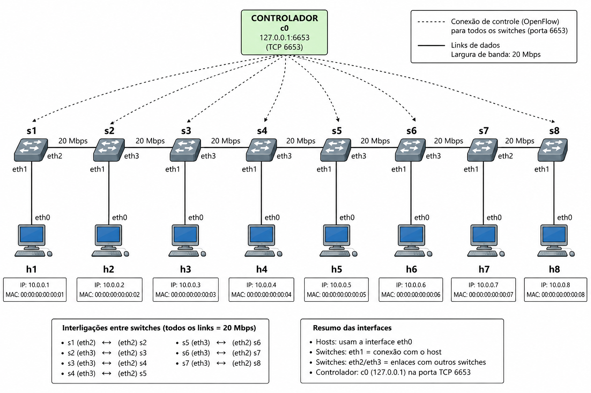

---

### Passo 4: Testes de Conectividade com Ping e Tcpdump (Item d)

Nesta etapa, foram validados os testes de conectividade entre os nós e capturados os pacotes com `tcpdump` para demonstrar a transmissão dos dados através da rede.

#### 4.1 Alocação do Tcpdump

Terminais virtuais (xterm) foram configurados em modo escuta para capturar pacotes em hosts específicos:

```bash
xterm h2 h3 h4
```

Nos xterms abertos, foram iniciadas captura de tráfego em paralelo:

```bash
# Em xterm h2
tcpdump -XX -n -i h2-eth0

# Em xterm h3
tcpdump -XX -n -i h3-eth0

# Em xterm h4
tcpdump -XX -n -i h4-eth0
```


#### 4.2 Teste Global (pingall)

Disparo de ping entre cada par de hosts existente na rede linear:

```bash
pingall
```

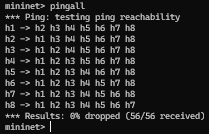

#### 4.3 Teste Direcionado (h1 para h8)

Envio de 5 pacotes ICMP entre os hosts mais distantes da topologia:

```bash
h1 ping -c 5 h8
```


#### 4.4 Captura de Pacotes na Interface

Durante os testes de ping, os xterms do tcpdump registraram a chegada de pacotes ARP e ICMP, confirmando a descoberta de rotas através do controlador e a entrega bem-sucedida dos pacotes:

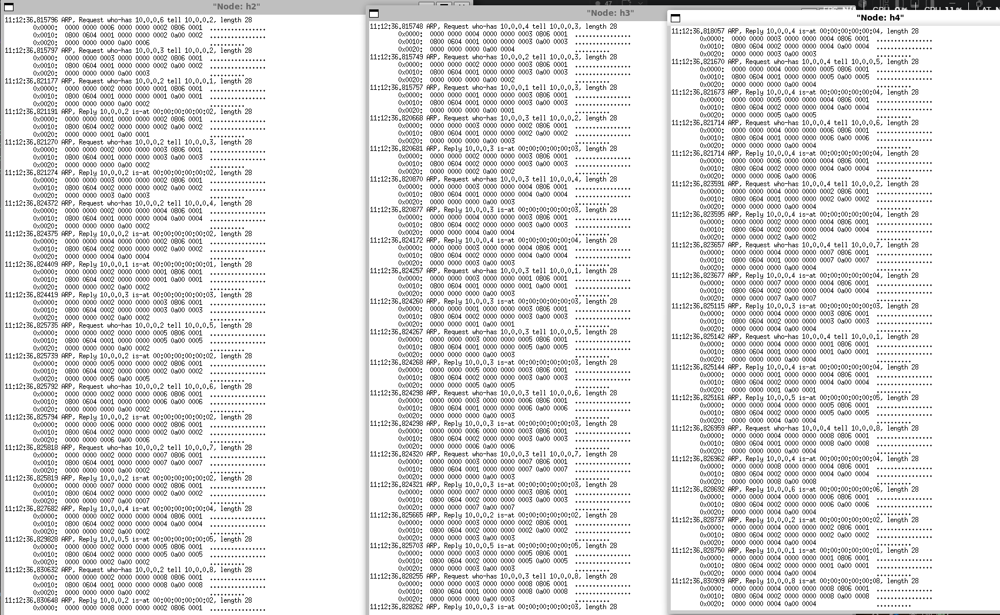

---

### Passo 5: Análise de Desempenho com Iperf (Item e)

No teste final, verificou-se o comportamento da rede sob carga TCP utilizando o `iperf`. O **host 1 (h1) foi configurado como servidor TCP** na porta 5555, e o **host 3 (h3) como cliente**. Foram realizados testes com duração de 15 segundos e relatórios a cada 1 segundo, considerando três cenários de largura de banda: 20 Mbps, 30 Mbps e 40 Mbps.

#### 5.1 Banda de 20 Mbps

**Configuração:** Topologia linear com 8 switches, bw = 20 Mbps (já criada).

Abertura de terminais virtuais:

```bash
xterm h1 h3
```

**No xterm de h1 (Servidor TCP):**

```bash
iperf -s -p 5555 -i 1
```

**No xterm de h3 (Cliente):**

```bash
iperf -c 10.0.0.1 -p 5555 -i 1 -t 15
```

**Resultados obtidos:**


A vazão observada manteve-se próxima ao limite configurado de 20 Mbps, confirmando que a rede operou conforme o esperado.

---

#### 5.2 Banda de 30 Mbps

Para testar o comportamento com maior capacidade, a topologia foi reconstruída com 30 Mbps:

```bash
exit
sudo mn -c
sudo mn --topo=linear,8 --mac --link tc,bw=30
xterm h1 h3
```

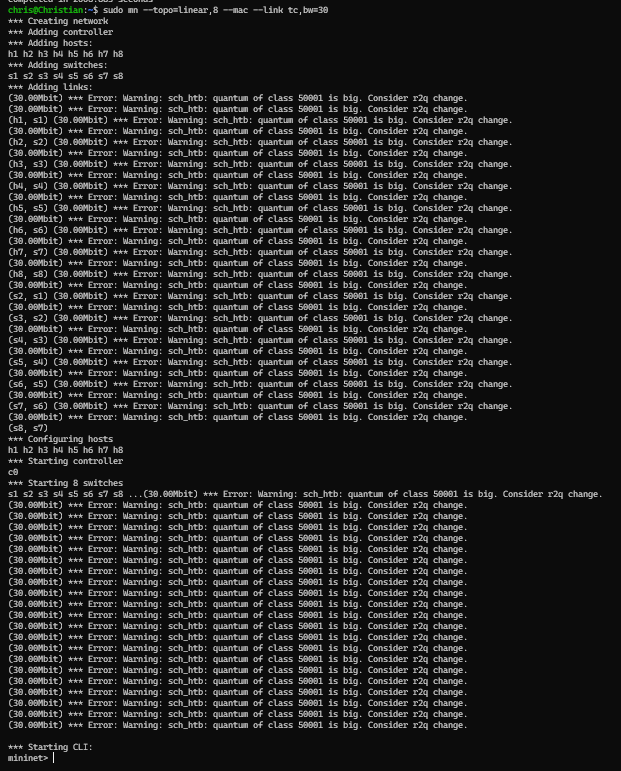

Repetindo os comandos do iperf:

```bash
# No xterm de h1 (Servidor)
iperf -s -p 5555 -i 1

# No xterm de h3 (Cliente)
iperf -c 10.0.0.1 -p 5555 -i 1 -t 15
```

**Resultados obtidos:**


A vazão aumentou proporcionalmente, aproximando-se de 30 Mbps, confirmando a escalabilidade da topologia.

---

#### 5.3 Banda de 40 Mbps

Finalmente, a topologia foi reconstruída com 40 Mbps para validar a performance máxima:

```bash
exit
sudo mn -c
sudo mn --topo=linear,8 --mac --link tc,bw=40
xterm h1 h3
```


Repetindo os testes de iperf:

```bash
# No xterm de h1 (Servidor)
iperf -s -p 5555 -i 1

# No xterm de h3 (Cliente)
iperf -c 10.0.0.1 -p 5555 -i 1 -t 15
```

**Resultados obtidos:**


A vazão atingiu aproximadamente 40 Mbps, validando o funcionamento completo da topologia sob diferentes condições de banda.

---

## Conclusões da Questão 1

Os testes realizados confirmaram que:

1. A topologia linear com 8 switches foi configurada com sucesso utilizando o Mininet.
2. O endereçamento MAC e IP foi padronizado conforme esperado.
3. A conectividade entre todos os nós foi validada através de testes de ping.
4. A captura de pacotes com tcpdump demonstrou o tráfego esperado na rede.
5. O desempenho de vazão (throughput) foi proporcional à largura de banda configurada em cada cenário (20, 30 e 40 Mbps).

---

---

# Questão 2: Topologia Customizada com Regras MAC em Python

## Relatório de Experimento: Topologia Customizada com Controlador Manual

Este documento apresenta os resultados obtidos durante a simulação de uma rede customizada utilizando Python no Mininet.

---

## 3. Configuração da Topologia Customizada

A topologia foi estruturada conforme especificação:

*   **Tipo:** Customizada em Python.
*   **Componentes:** 2 switches (s1, s2) e 5 hosts (h1, h2, h3, h4, h5).
*   **Estrutura:** 3 hosts conectados ao s1 (h1, h2, h3) e 2 hosts conectados ao s2 (h4, h5).
*   **Enlace inter-switches:** Um link direto entre s1 e s2.
*   **Endereçamento:** MAC padronizado via `--mac`.
*   **Controlador:** Manual (sem controlador automático, regras inseridas via `ovs-ofctl`).

---

## 4. Roteiro de Execução

### Passo 1: Criação do Código Python da Topologia (Item a)

Primeiramente, foi criado um arquivo Python (`topo-3h-2sw-2h.py`) que define a topologia customizada:

```python
#!/usr/bin/env python

from mininet.net import Mininet
from mininet.topo import Topo
from mininet.log import setLogLevel
from mininet.cli import CLI

class MyTopo(Topo):
    def build(self):
        # Criação dos switches
        s1 = self.addSwitch('s1')
        s2 = self.addSwitch('s2')

        # Hosts do lado esquerdo (conectados ao s1)
        h1 = self.addHost('h1')
        h2 = self.addHost('h2')
        h3 = self.addHost('h3')

        # Hosts do lado direito (conectados ao s2)
        h4 = self.addHost('h4')
        h5 = self.addHost('h5')

        # Links hosts → switches
        self.addLink(h1, s1)
        self.addLink(h2, s1)
        self.addLink(h3, s1)
        self.addLink(h4, s2)
        self.addLink(h5, s2)

        # Link entre switches
        self.addLink(s1, s2)

topos = {'mytopo': (lambda: MyTopo())}
```

A topologia foi criada com o comando padrão do Mininet, utilizando endereçamento MAC padronizado e controlador manual:

```bash
sudo mn --custom topo-3h-2sw-2h.py --topo mytopo --mac --controller=none
```

**Parâmetros utilizados:**

*   `--custom topo-3h-2sw-2h.py`: Carrega a topologia customizada definida em Python.
*   `--topo mytopo`: Especifica a topologia a utilizar.
*   `--mac`: Atribui endereços MAC sequenciais simplificados.
*   `--controller=none`: Desativa o controlador automático, permitindo inserir regras manualmente.

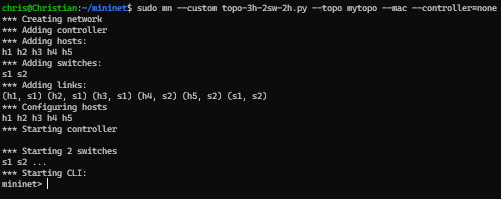

---

### Passo 2: Inspeção das Interfaces, MACs, IPs e Portas (Item b)

Após a inicialização, foram executados comandos dentro do CLI do Mininet (`mininet>`) para verificar a integridade da rede e o endereçamento dos nós.

#### 4.1 Listagem de Nós

O comando `nodes` permite visualizar todos os elementos ativos:

```bash
nodes
```

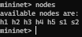

#### 4.2 Mapeamento de Enlaces e Portas

Através do comando `net`, identificam-se as conexões físicas:

```bash
net
```

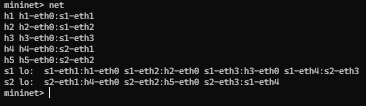

#### 4.3 Informações Detalhadas (Dump)

O comando `dump` mostra endereços IP e PIDs dos processos:

```bash
dump
```

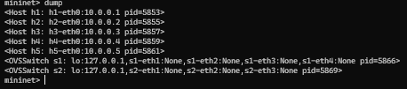

#### 4.4 Configuração de Interfaces (ifconfig)

Inspeção dos endereços MAC e IP:

```bash
h1 ifconfig
h4 ifconfig
```

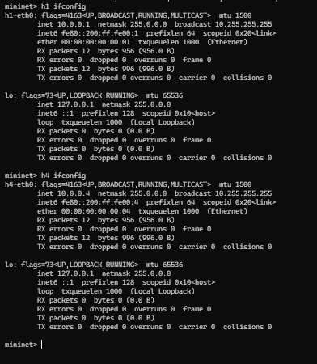

Interfaces detalhadas dos switches:

```bash
s1 ifconfig -a
s2 ifconfig -a
```

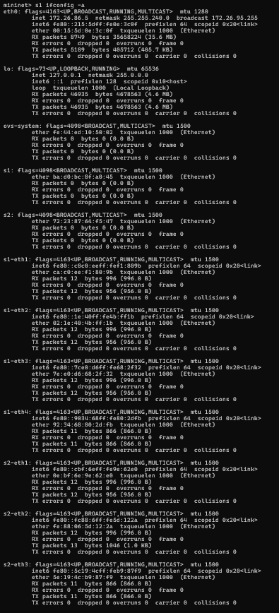

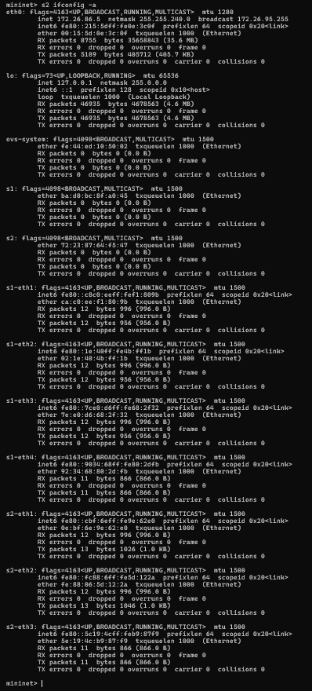

#### 4.5 Portas OpenFlow dos Switches

Para visualizar as portas OpenFlow e suas associações com os hosts:

```bash
sh ovs-ofctl show s1
sh ovs-ofctl show s2
```

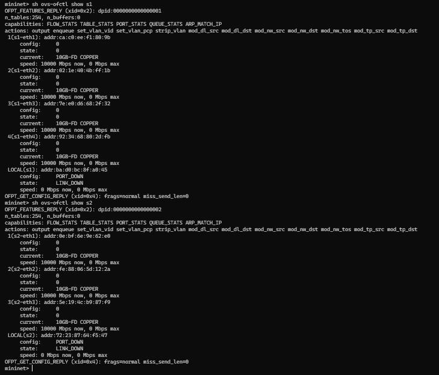

---

### Passo 3: Desenho Ilustrativo da Topologia (Item c)

Com base nas informações obtidas através do `dump` e `net`, a estrutura da topologia customizada apresenta-se do seguinte modo:

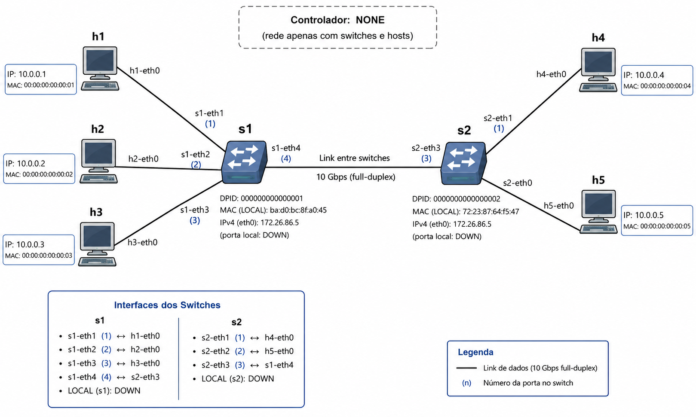

---

### Passo 4: Testes de Ping com Switches Normais (Item d)

Nesta etapa, foram validados os testes de conectividade utilizando ação `action=normal`, que simula o comportamento de um switch convencional (learning bridge).

#### 5.1 Adição de Regras de Comportamento Normal

Antes de executar os testes, foram adicionadas regras para permitir que os switches funcionem em modo normal:

```bash
sh ovs-ofctl add-flow s1 action=normal
sh ovs-ofctl add-flow s2 action=normal
```

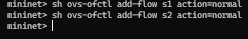

#### 5.2 Teste Global (pingall)

Teste de ping entre todos os pares de hosts da rede:

```bash
pingall
```

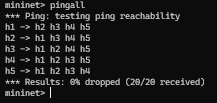

O resultado demonstrou 0% dropped, confirmando que todos os hosts se comunicaram com sucesso.

#### 5.3 Teste Direcionado (h1 para h4)

Ping entre hosts de switches diferentes:

```bash
h1 ping -c 5 h4
```

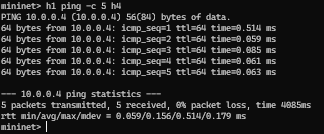

#### 5.4 Teste Direcionado (h3 para h5)

Outro teste entre hosts de switches diferentes:

```bash
h3 ping -c 5 h5
```

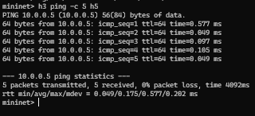

---

### Passo 5: Remoção de Regras e Implementação de Regras Baseadas em MAC (Item e)

Nesta etapa, foram removidas todas as regras anteriores e implementadas novas regras baseadas em endereços MAC para controlar seletivamente o tráfego entre hosts de diferentes switches.

#### 6.1 Remoção de Todas as Regras

Para limpar a tabela de fluxos dos switches:

```bash
sh ovs-ofctl del-flows s1
sh ovs-ofctl del-flows s2
```

Verificação das tabelas vazias:

```bash
sh ovs-ofctl dump-flows s1
sh ovs-ofctl dump-flows s2
```

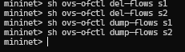

#### 6.2 Validação de Comunicação Interrompida

Antes de implementar as novas regras, foi confirmado que sem regras não há comunicação:

```bash
pingall
```

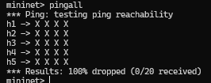

O resultado mostrou 100% dropped, confirmando que sem regras a rede está desconectada.

#### 6.3 Implementação de Regras MAC para h1 ↔ h4

Criação de regras bidireccionais baseadas em MAC entre h1 (s1) e h4 (s2):

**No s1 (tráfego de h1 para h4 sai pela porta 4, tráfego de h4 retorna pela porta 1):**

```bash
sh ovs-ofctl add-flow s1 dl_src=00:00:00:00:00:01,dl_dst=00:00:00:00:00:04,actions=output:4
sh ovs-ofctl add-flow s1 dl_src=00:00:00:00:00:04,dl_dst=00:00:00:00:00:01,actions=output:1
```

**No s2 (tráfego de h1 para h4 sai pela porta 1, tráfego de h4 retorna pela porta 3):**

```bash
sh ovs-ofctl add-flow s2 dl_src=00:00:00:00:00:01,dl_dst=00:00:00:00:00:04,actions=output:1
sh ovs-ofctl add-flow s2 dl_src=00:00:00:00:00:04,dl_dst=00:00:00:00:00:01,actions=output:3
```

#### 6.4 Implementação de Regras MAC para h2 ↔ h5

Criação de regras bidireccionais baseadas em MAC entre h2 (s1) e h5 (s2):

**No s1:**

```bash
sh ovs-ofctl add-flow s1 dl_src=00:00:00:00:00:02,dl_dst=00:00:00:00:00:05,actions=output:4
sh ovs-ofctl add-flow s1 dl_src=00:00:00:00:00:05,dl_dst=00:00:00:00:00:02,actions=output:2
```

**No s2:**

```bash
sh ovs-ofctl add-flow s2 dl_src=00:00:00:00:00:02,dl_dst=00:00:00:00:00:05,actions=output:2
sh ovs-ofctl add-flow s2 dl_src=00:00:00:00:00:05,dl_dst=00:00:00:00:00:02,actions=output:3
```

#### 6.5 Permissão de Tráfego ARP

Para que o ping funcionar via resolução de endereços IP, é necessário permitir o tráfego ARP (Protocol type 0x0806):

```bash
sh ovs-ofctl add-flow s1 dl_type=0x0806,action=flood
sh ovs-ofctl add-flow s2 dl_type=0x0806,action=flood
```

#### 6.6 Verificação das Regras Implementadas

Visualização de todas as regras MAC criadas:

```bash
sh ovs-ofctl dump-flows s1
sh ovs-ofctl dump-flows s2
```

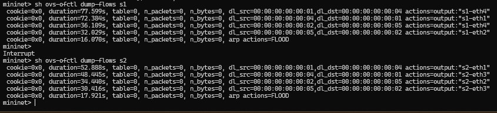

---

### Passo 6: Testes de Ping para Validar as Regras (Item f)

Nesta etapa final, foram executados testes de ping para demonstrar que as regras MAC foram implementadas corretamente e que apenas os pares de hosts mapeados conseguem se comunicar.

#### 7.1 Teste de Comunicação Permitida (h1 ↔ h4)

Teste de ping entre h1 e h4 (par mapeado com regras MAC):

```bash
h1 ping -c 5 h4
```

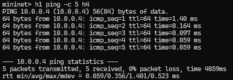

O resultado demonstrou 100% sucesso (0% lost), confirmando que a comunicação está permitida via regras MAC.

#### 7.2 Teste de Comunicação Permitida (h2 ↔ h5)

Teste de ping entre h2 e h5 (par mapeado com regras MAC):

```bash
h2 ping -c 5 h5
```

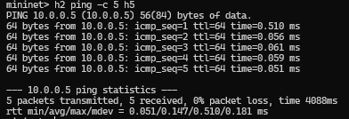

O resultado também demonstrou 100% sucesso.

#### 7.3 Teste de Comunicação Bloqueada (h1 ↔ h5)

Teste de ping entre h1 e h5 (par não mapeado, deve falhar):

```bash
h1 ping -c 3 h5
```

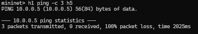

O resultado demonstrou 100% lost, confirmando que sem regra MAC específica, a comunicação é bloqueada.

#### 7.4 Teste de Comunicação Bloqueada (h3 ↔ h4)

Teste de ping entre h3 e h4 (par não mapeado, deve falhar):

```bash
h3 ping -c 3 h4
```

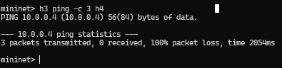

O resultado demonstrou 100% lost, confirmando que sem regra MAC específica, a comunicação é bloqueada.

#### 7.5 Captura de Tráfego com Tcpdump (Validação Visual)

Para evidenciar o funcionamento das regras MAC, foram abertos terminais virtuais de h4 e h5:

```bash
xterm h4 h5
```

Nos terminais abertos, foi iniciada captura de tráfego:

**No xterm de h4:**

```bash
tcpdump -XX -n -i h4-eth0
```

**No xterm de h5:**

```bash
tcpdump -XX -n -i h5-eth0
```

Teste de ping h1 → h4 no CLI do Mininet:

```bash
h1 ping -c 3 h4
```

**Resultado:** Pacotes capturados apenas em h4, confirmando que a regra MAC direcionou o tráfego corretamente.

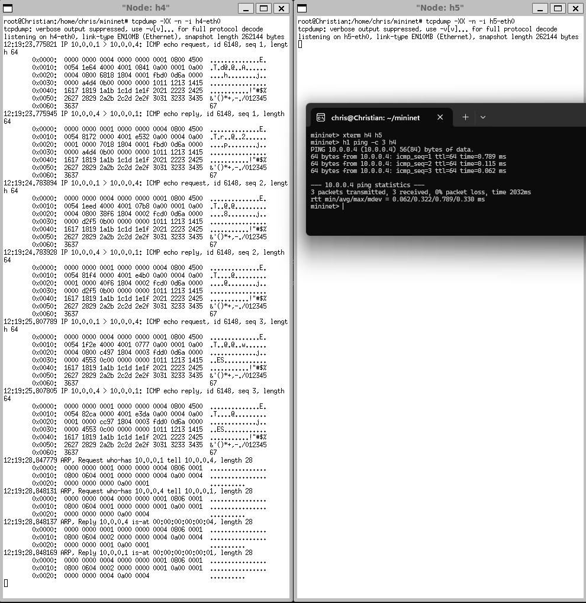

---

## Conclusões da Questão 2

Os testes realizados confirmaram que:

1. A topologia customizada foi criada com sucesso utilizando Python e o Mininet.
2. O endereçamento MAC e IP foi padronizado conforme esperado.
3. Com regras `action=normal`, todos os hosts conseguem se comunicar (comportamento de switch convencional).
4. As regras MAC foram implementadas corretamente, permitindo comunicação seletiva entre pares de hosts específicos.
5. A remoção de regras bloqueou completamente a comunicação entre switches.
6. A captura de tráfego com tcpdump validou visualmente que os pacotes seguem apenas as rotas especificadas pelas regras MAC.
7. Hosts sem regra MAC específica não conseguem se comunicar entre switches, demonstrando o controle fino sobre o tráfego.

---
