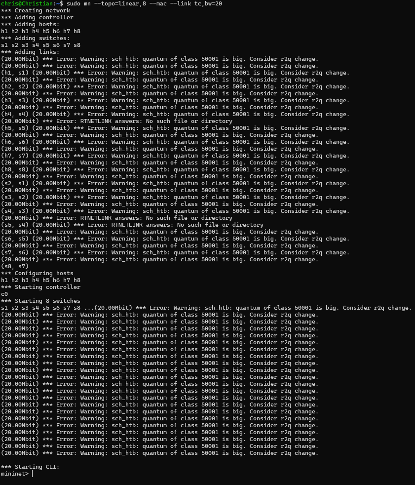
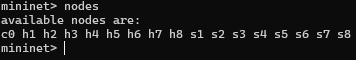
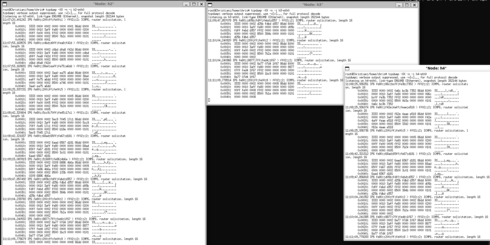
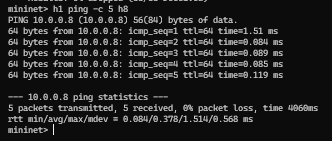
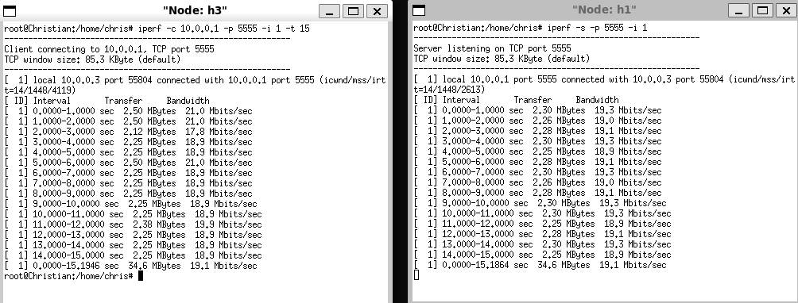
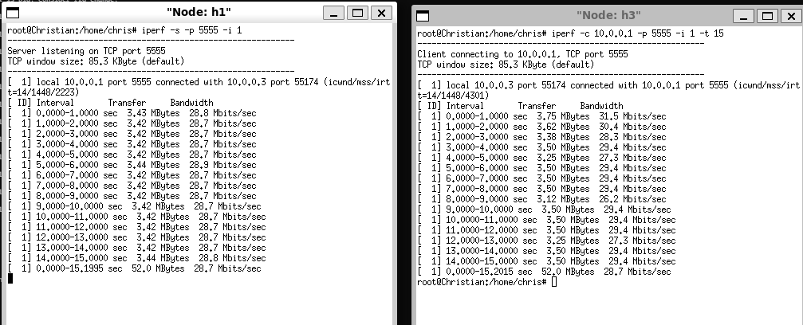
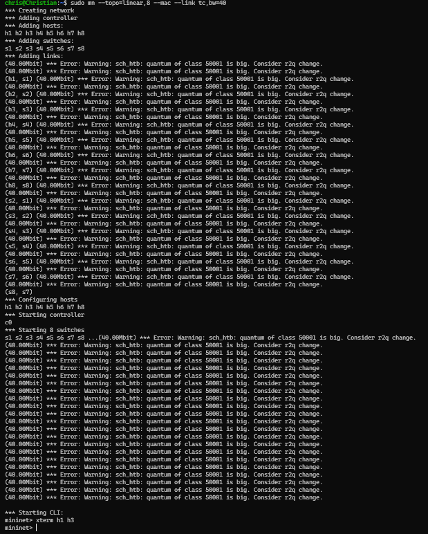
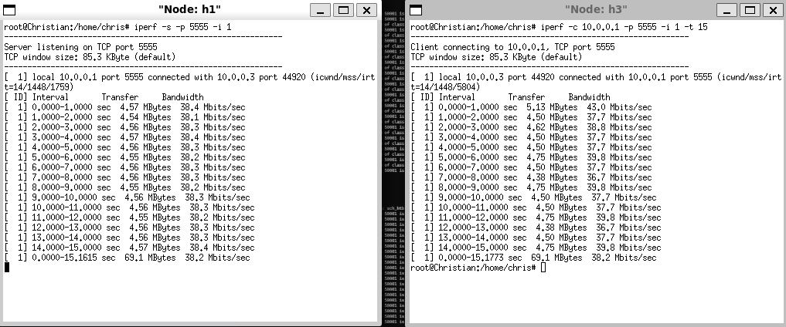

# Questão 1: Simulação de Topologia Linear com Mininet

## Relatório de Experimento: Topologia Linear com 8 Switches

Este documento apresenta os resultados obtidos durante a simulação de uma rede de computadores utilizando a ferramenta Mininet.

---

## 1. Configuração da Topologia

A topologia foi estruturada seguindo os requisitos propostos:

*   **Tipo:** Linear.
*   **Componentes:** 8 switches (s1 a s8) e 8 hosts (h1 a h8).
*   **Endereçamento:** MAC padronizado via `--mac`.
*   **Largura de Banda:** 20 Mbps (inicial), posteriormente 30 Mbps e 40 Mbps.
*   **Controlador:** Padrão do Mininet.

---

## 2. Roteiro de Execução

### Passo 1: Inicialização da Rede (Item a)

Para criar a topologia linear com largura de banda inicial de 20 Mbps, foi utilizado o comando padrão do Mininet, configurando endereçamento MAC sequencial e limites de banda:

```bash
sudo mn --topo=linear,8 --mac --link tc,bw=20
```

**Parâmetros utilizados:**

*   `--topo=linear,8`: Cria uma topologia linear com 8 switches, cada um conectado a 1 host de acesso.
*   `--mac`: Atribui endereços MAC sequenciais simplificados.
*   `--link tc,bw=20`: Define a largura de banda de todos os enlaces em 20 Mbps.
*   **Controlador:** Padrão do Mininet (não especificado, utiliza o padrão do sistema).



---

### Passo 2: Inspeção das Interfaces, MACs, IPs e Portas (Item b)

Após a inicialização, foram executados comandos dentro do CLI do Mininet (`mininet>`) para verificar a integridade da rede, o endereçamento dos nós e as portas de conexão.

#### 2.1 Listagem de Nós

O comando `nodes` permite visualizar todos os elementos ativos na simulação:

```bash
nodes
```



#### 2.2 Mapeamento de Enlaces e Portas

Através do comando `net`, identificam-se as conexões físicas entre os componentes:

```bash
net
```


#### 2.3 Informações Detalhadas (Dump)

O comando `dump` mostra detalhes técnicos como endereços IP de cada host e o PID dos respectivos processos:

```bash
dump
```


#### 2.4 Configuração de Interfaces (ifconfig)

Para inspecionar e documentar os endereços IP, MAC e interfaces internas, aplicou-se `ifconfig` nos componentes:

```bash
h1 ifconfig
h2 ifconfig
```


Inspeção detalhada com `ifconfig -a`:

```bash
h1 ifconfig -a
```


```bash
s1 ifconfig -a
```


.png)

.png)

---

### Passo 3: Desenho Ilustrativo da Topologia (Item c)

Com base nas informações obtidas através do `dump` e `net`, a estrutura linear desta topologia apresenta-se do seguinte modo:

#### 3.1 Tabela de Endereços Padronizados

Os endereços IP e MAC foram gerados automaticamente pelo parâmetro `--mac`:

| Host | IP         | MAC               | Switch | Interface   |
|------|------------|-------------------|--------|-------------|
| h1   | 10.0.0.1   | 00:00:00:00:00:01 | s1     | eth0        |
| h2   | 10.0.0.2   | 00:00:00:00:00:02 | s2     | eth0        |
| h3   | 10.0.0.3   | 00:00:00:00:00:03 | s3     | eth0        |
| h4   | 10.0.0.4   | 00:00:00:00:00:04 | s4     | eth0        |
| h5   | 10.0.0.5   | 00:00:00:00:00:05 | s5     | eth0        |
| h6   | 10.0.0.6   | 00:00:00:00:00:06 | s6     | eth0        |
| h7   | 10.0.0.7   | 00:00:00:00:00:07 | s7     | eth0        |
| h8   | 10.0.0.8   | 00:00:00:00:00:08 | s8     | eth0        |

#### 3.2 Diagrama da Topologia


---

### Passo 4: Testes de Conectividade com Ping e Tcpdump (Item d)

Nesta etapa, foram validados os testes de conectividade entre os nós e capturados os pacotes com `tcpdump` para demonstrar a transmissão dos dados através da rede.

#### 4.1 Alocação do Tcpdump

Terminais virtuais (xterm) foram configurados em modo escuta para capturar pacotes em hosts específicos:

```bash
xterm h2 h3 h4
```

Nos xterms abertos, foram iniciadas captura de tráfego em paralelo:

```bash
# Em xterm h2
tcpdump -XX -n -i h2-eth0

# Em xterm h3
tcpdump -XX -n -i h3-eth0

# Em xterm h4
tcpdump -XX -n -i h4-eth0
```



#### 4.2 Teste Global (pingall)

Disparo de ping entre cada par de hosts existente na rede linear:

```bash
pingall
```


#### 4.3 Teste Direcionado (h1 para h8)

Envio de 5 pacotes ICMP entre os hosts mais distantes da topologia:

```bash
h1 ping -c 5 h8
```



#### 4.4 Captura de Pacotes na Interface

Durante os testes de ping, os xterms do tcpdump registraram a chegada de pacotes ARP e ICMP, confirmando a descoberta de rotas através do controlador e a entrega bem-sucedida dos pacotes:


---

### Passo 5: Análise de Desempenho com Iperf (Item e)

No teste final, verificou-se o comportamento da rede sob carga TCP utilizando o `iperf`. O **host 1 (h1) foi configurado como servidor TCP** na porta 5555, e o **host 3 (h3) como cliente**. Foram realizados testes com duração de 15 segundos e relatórios a cada 1 segundo, considerando três cenários de largura de banda: 20 Mbps, 30 Mbps e 40 Mbps.

#### 5.1 Banda de 20 Mbps

**Configuração:** Topologia linear com 8 switches, bw = 20 Mbps (já criada).

Abertura de terminais virtuais:

```bash
xterm h1 h3
```

**No xterm de h1 (Servidor TCP):**

```bash
iperf -s -p 5555 -i 1
```

**No xterm de h3 (Cliente):**

```bash
iperf -c 10.0.0.1 -p 5555 -i 1 -t 15
```

**Resultados obtidos:**



A vazão observada manteve-se próxima ao limite configurado de 20 Mbps, confirmando que a rede operou conforme o esperado.

---

#### 5.2 Banda de 30 Mbps

Para testar o comportamento com maior capacidade, a topologia foi reconstruída com 30 Mbps:

```bash
exit
sudo mn -c
sudo mn --topo=linear,8 --mac --link tc,bw=30
xterm h1 h3
```


Repetindo os comandos do iperf:

```bash
# No xterm de h1 (Servidor)
iperf -s -p 5555 -i 1

# No xterm de h3 (Cliente)
iperf -c 10.0.0.1 -p 5555 -i 1 -t 15
```

**Resultados obtidos:**



A vazão aumentou proporcionalmente, aproximando-se de 30 Mbps, confirmando a escalabilidade da topologia.

---

#### 5.3 Banda de 40 Mbps

Finalmente, a topologia foi reconstruída com 40 Mbps para validar a performance máxima:

```bash
exit
sudo mn -c
sudo mn --topo=linear,8 --mac --link tc,bw=40
xterm h1 h3
```



Repetindo os testes de iperf:

```bash
# No xterm de h1 (Servidor)
iperf -s -p 5555 -i 1

# No xterm de h3 (Cliente)
iperf -c 10.0.0.1 -p 5555 -i 1 -t 15
```

**Resultados obtidos:**



A vazão atingiu aproximadamente 40 Mbps, validando o funcionamento completo da topologia sob diferentes condições de banda.

---

## Conclusões

Os testes realizados confirmaram que:

1. A topologia linear com 8 switches foi configurada com sucesso utilizando o Mininet.
2. O endereçamento MAC e IP foi padronizado conforme esperado.
3. A conectividade entre todos os nós foi validada através de testes de ping.
4. A captura de pacotes com tcpdump demonstrou o tráfego esperado na rede.
5. O desempenho de vazão (throughput) foi proporcional à largura de banda configurada em cada cenário (20, 30 e 40 Mbps).

---
